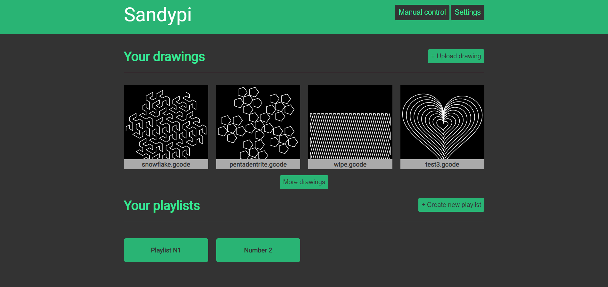
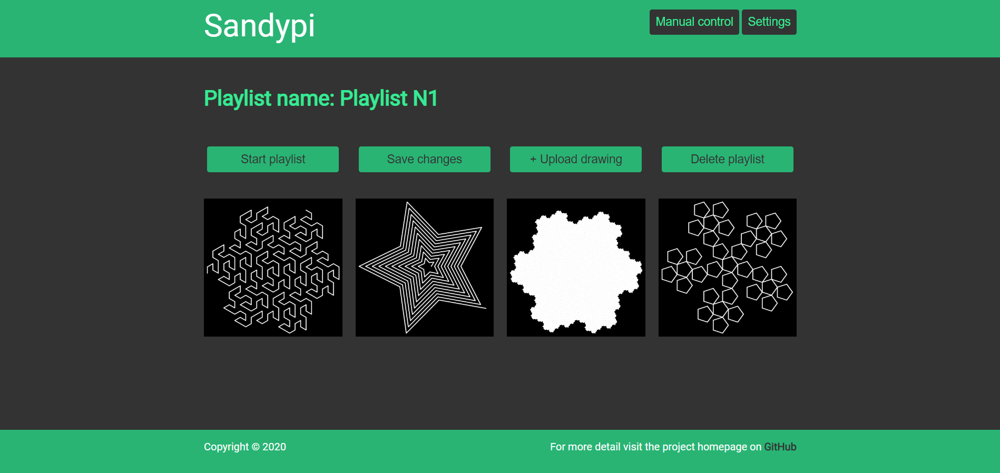
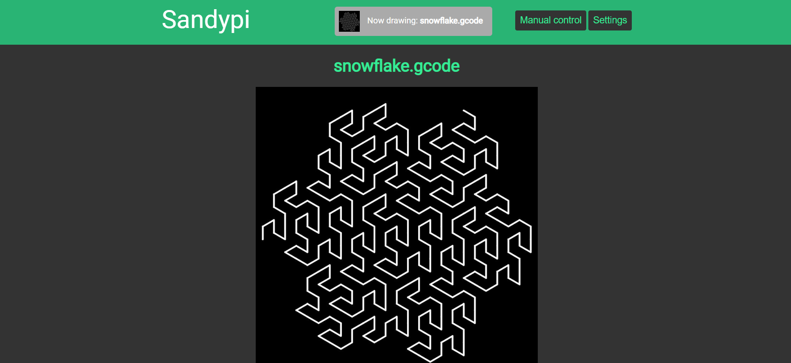
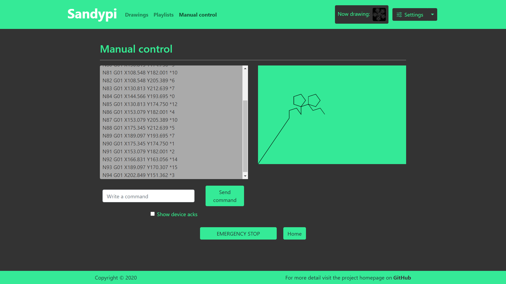

# SandyPi

A python program to feed your automatic zen table with a fresh design everyday

## The idea

Zen tables are beautiful but I don't like to see always the same drawing on the sand: I would like to have a fresh design waiting for me every morning at coffee time.

The program can run on a Raspberry Pi connected to your zen table and change the drawing overnight.
You can control the drawings through the web interface from your device connected to the network (smartphone, tablet or computer independently thanks to the web interface).

Upload your designs, create ordered playlists or let the software randomly choose your next design.

The final aim of the project is to create something similar to a social network to share your drawings and to collect designs from others to get everyday a fresh design on your table.

## The project

The aim of the project is to create something focused on the sandtables. For sure, other solution exist (like octoprint) but their aim is for 3D printers thus the experience is not optimized for this application.

The project is still work-in-progress which means you may encounter some bug or problems. Please, check the issues or opena new one if you are facing something wrong.

The project is opensource under MIT license and thus anyone can help (there is so much to do!).

### Some screenshots






## Installation

Now it is possible to install Sandypi with Docker. In this way the installation is much simpler and less prone to errors.
See the [new installation procedure here](docker/readme.md).

The old installation procedure is considered deprecated and should not be used. It may be usefull only for development purposes. For this reason, it is still [available here](docs/old_installation.md).

## Additional hardware setup

### Buttons

The software supports the usage of hardware buttons.
Wire the buttons and select the type of wiring from the settings section (pull-up/pull-down, internal/external).
Once the wiring type and the pin number is specified it is possible to associate a specific function to click and long press events on the button.

### LEDs

It is possible to control LEDs strips directly from the interface. [Check the full procedure for more info](/docs/hardware/leds.md).

## Installation troubleshooting

If you find problems during the installation check the [troubleshooting](/docs/troubleshooting.md) page

**If you find any bug or problem please feel free to open an [issue](https://github.com/texx00/sandypi/issues) in the dedicated page.**
___

## Boards and firmwares

At the moment, the software is tested only with Marlin 2.0 and Grbl 1.1
Should be compatible with other firmwares as well. If not please open an issue.

The software is running in Docker. The images are compatible with armv7 (Raspberry Pi) and amd64 (Linux and Windows with wsl).

Once the software is correctly installed it is necessary to select the correct firmware used on the sandtable. This can be done through the web interface in the settings page. The interface can be reached through any browser by using the ip address of the device follower by `:5100` like `ip_address:5100`.

### Marlin 2.0 setup

In the settings select the serial port, the correct baudrate (usually 115200 or 250000) and the correct firmware type.

### Grbl 1.1

In the settings select the serial port, the correct baudrate (usually 115200 or 250000) and the correct firmware type.

## Updates

With Docker, the software can update itself automatically to the latest version automatically.
By default, this behaviour is disabled but you can enable automatic updates in the settings section of the UI.
If you want to force the update manually use (from the folder in which you downloaded the docker-compose.yml file):

```bash
$> docker-compose pull
$> docker-compose up -d
```

If a new version of the docker-compose.yml file is released, the software will not be able to automatically update the file. A notification will appear in Sandypi and a reminder will be always shown in the settings page.
To update the docker-compose file follow the same instructions of the [installation procedure](docker/readme.md).

___
*NOTE:* the software is still in **ALPHA** which means lots of features may not work as expected. Updates may fix some but may also introduce more bugs. If you find any please open an issue.
___

## Development and testing

Any help in the app development is accepted.
Also testing the software counts! If you find any bug or you have any idea just check if an issue is already open for that topic or open it yourself.
For the coding, debugging and so on check the [development section](/docs/development.md).

## Current status

The project still need a lot of work.
Here is a brief list of what the software is capable of and what will be implemented for sure in the future:

* [x] Web interface to be accessible from different devices over the network
* [x] Connection to the hardware controller through serial
* [x] Simple installation script to simplify the installation
* [x] Run the application on a single page with full js frontend and python (flask) backend
* [x] Upload locally your designs (with a preview as well) to keep them all in the same place
* [x] Create playlists and manage the designs
* [x] Run a drawing whenever you want
* [x] Run gcode commands manually
* [x] Feed the table periodically
* [x] Shuffle mode to play shuffled drawings continuosly
* [x] Show the realtime gcode simulation with time estimate (ETA)
* [x] Simple lights/led control
* [x] Update the software automatically
* [x] Interact with physical buttons to control the table
* [ ] Create logo
* [ ] Run the server not on a production server
* [ ] Advanced lights controls: syncronization between lights and ball
* [ ] Sandify "integration" (like upload a drawing directly from sandify or modify an uploaded drawing)?
* [ ] Add translations for different languages?
* [ ] Possibility to control multiple tables?
* [ ] A lot more stuff... Just ask to know what you can help with or have a look at the [todo file](todos.md) for more detailed goals

In a far far away future:

* [ ] Create a social network to share designs and update your personal playlists

## Versions

Check the latest version infos [here](docs/versions.md)
